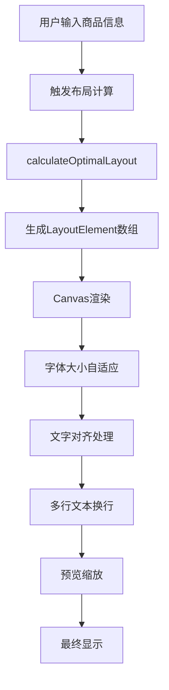

# 标价签预览渲染技术文档

## 概述

AutoPriceTag 的标价签预览系统采用基于 Canvas 的实时渲染技术，结合智能布局算法，为用户提供所见即所得的标签设计体验。本文档详细介绍了渲染系统的技术架构、布局算法和实现细节。

## 技术架构

### 核心组件

```
LabelCanvas (React组件)
├── Canvas 渲染引擎
├── 智能布局计算器 (autoLayout.ts)
├── 字体渲染系统
└── 预览缩放系统
```

### 渲染流程



## 布局算法详解

### 1. 智能空间分配

#### 核心元素权重系统
```typescript
const CORE_ELEMENTS = [
  { id: 'product_name', key: 'name', priority: 1, weight: 0.3 },      // 商品名称 30%
  { id: 'product_price', key: 'price', priority: 2, weight: 0.25 },   // 价格 25%
  { id: 'brand', key: 'brand', priority: 3, weight: 0.15 },            // 品牌 15%
  { id: 'selling_points', key: 'sellingPoints', priority: 4, weight: 0.2 }, // 卖点 20%
  { id: 'specs', key: 'specs', priority: 5, weight: 0.1 },             // 规格 10%
];
```

#### 垂直空间分配算法
```typescript
function allocateVerticalSpace(elements, availableHeight, spacing, config) {
  const totalSpacing = (elements.length - 1) * spacing;
  const contentHeight = availableHeight - totalSpacing;
  
  // 按权重分配空间
  const totalWeight = elements.reduce((sum, el) => sum + el.weight, 0);
  const allocation = {};
  
  for (const element of elements) {
    const baseHeight = (element.weight / totalWeight) * contentHeight;
    const minHeight = config.minFontSize * config.lineHeight;
    const maxHeight = config.maxFontSize * config.lineHeight * 3;
    
    allocation[element.id] = Math.max(minHeight, Math.min(maxHeight, baseHeight));
  }
  
  return allocation;
}
```

### 2. 字体大小自适应

#### 动态字体计算
```typescript
function calculateOptimalFontSize(text, maxWidth, maxHeight, config) {
  const canvas = document.createElement('canvas');
  const ctx = canvas.getContext('2d');
  
  let fontSize = config.maxFontSize;
  
  while (fontSize >= config.minFontSize) {
    ctx.font = `${fontSize}px "Noto Sans SC", "Microsoft YaHei", "PingFang SC", "Hiragino Sans GB", sans-serif`;
    const metrics = ctx.measureText(text);
    const textWidth = metrics.width;
    const textHeight = fontSize * config.lineHeight;
    
    if (textWidth <= maxWidth && textHeight <= maxHeight) {
      return fontSize;
    }
    
    fontSize -= 0.5; // 精细调整步长
  }
  
  return config.minFontSize;
}
```

#### 字体栈配置
```typescript
const FONT_STACK = [
  "Noto Sans SC",      // 思源黑体 - 主要中文字体
  "Microsoft YaHei",    // 微软雅黑 - Windows 系统字体
  "PingFang SC",        // 苹方 - macOS 系统字体
  "Hiragino Sans GB",   // 冬青黑体 - iOS 系统字体
  "sans-serif"          // 系统默认无衬线字体
];
```

### 3. 多行文本处理

#### 智能换行算法
```typescript
function calculateTextLayout(text, maxWidth, fontSize) {
  const canvas = document.createElement('canvas');
  const ctx = canvas.getContext('2d');
  
  ctx.font = `${fontSize}px ${FONT_STACK.join(', ')}`;
  
  // 按字符分割，更好地处理中文
  const chars = text.split('');
  const lines = [];
  let currentLine = '';
  
  for (const char of chars) {
    const testLine = currentLine + char;
    const testWidth = ctx.measureText(testLine).width;
    
    if (testWidth <= maxWidth) {
      currentLine = testLine;
    } else {
      if (currentLine) {
        lines.push(currentLine);
        currentLine = char;
      } else {
        lines.push(char); // 单个字符超宽
        currentLine = '';
      }
    }
  }
  
  if (currentLine) lines.push(currentLine);
  
  // 限制最多3行
  if (lines.length > 3) {
    lines.splice(3);
    lines[2] = lines[2].substring(0, lines[2].length - 3) + '...';
  }
  
  return {
    lines: lines.length,
    text: lines.join('\n')
  };
}
```

### 4. 文字对齐系统

#### 智能对齐策略
```typescript
function getOptimalAlignment(width, height) {
  const aspectRatio = width / height;
  
  if (aspectRatio > 2) {
    return 'center';  // 横版标签 - 居中对齐
  } else if (aspectRatio < 0.8) {
    return 'left';    // 竖版标签 - 左对齐
  } else {
    return 'center';  // 方形标签 - 居中对齐
  }
}
```

#### 对齐渲染实现
```typescript
// 居中对齐
if (element.align === 'center') {
  const textWidth = ctx.measureText(line).width;
  x = previewSize.width / 2 - textWidth / 2;
}

// 右对齐
else if (element.align === 'right') {
  const textWidth = ctx.measureText(line).width;
  x = previewSize.width - textWidth - (element.x * scale);
}
```

## 预览缩放系统

### 1. 固定比例预览

#### 预览尺寸计算
```typescript
function calculatePreviewSizeByRatio(labelWidth, labelHeight) {
  const maxWidth = 500;   // 最大预览宽度
  const maxHeight = 350; // 最大预览高度
  
  const aspectRatio = labelWidth / labelHeight;
  
  let previewWidth = maxWidth;
  let previewHeight = previewWidth / aspectRatio;
  
  // 高度超出时重新计算
  if (previewHeight > maxHeight) {
    previewHeight = maxHeight;
    previewWidth = previewHeight * aspectRatio;
  }
  
  return { width: previewWidth, height: previewHeight };
}
```

### 2. 高DPI渲染

#### 渲染质量优化
```typescript
const renderScale = 2; // 2倍渲染质量
const canvasWidth = previewSize.width * renderScale;
const canvasHeight = previewSize.height * renderScale;

canvas.width = canvasWidth;
canvas.height = canvasHeight;

// 设置显示尺寸
canvas.style.width = `${previewSize.width}px`;
canvas.style.height = `${previewSize.height}px`;

// 应用缩放
ctx.scale(renderScale, renderScale);
```

## 单位转换系统

### 精确的像素转换

#### mm到像素转换
```typescript
function mmToPixels(mm) {
  // 1mm ≈ 3.7795275591px (96 DPI)
  // 使用精确的转换系数确保准确性
  return mm * 3.7795275591;
}

function pixelsToMm(pixels) {
  return pixels / 3.7795275591;
}
```

#### 转换精度说明
- **96 DPI**: 标准屏幕分辨率
- **转换系数**: 3.7795275591 (精确到小数点后10位)
- **应用场景**: 标签尺寸设置、布局计算、导出DPI

## 视觉设计系统

### 1. 优雅的边框效果

#### 阴影和高光系统
```typescript
function drawElegantDivider(ctx, width, height) {
  // 微妙阴影效果
  ctx.shadowColor = 'rgba(0, 0, 0, 0.1)';
  ctx.shadowOffsetX = 2;
  ctx.shadowOffsetY = 2;
  ctx.shadowBlur = 4;
  
  // 绘制标签轮廓
  ctx.strokeStyle = 'rgba(156, 163, 175, 0.3)';
  ctx.lineWidth = 1;
  ctx.strokeRect(0, 0, width, height);
  
  // 清除阴影
  ctx.shadowColor = 'transparent';
  ctx.shadowOffsetX = 0;
  ctx.shadowOffsetY = 0;
  ctx.shadowBlur = 0;
  
  // 内部高光
  ctx.strokeStyle = 'rgba(255, 255, 255, 0.2)';
  ctx.lineWidth = 0.5;
  ctx.strokeRect(0.5, 0.5, width - 1, height - 1);
}
```

### 2. 响应式设计

#### 画布容器样式
```css
.canvas-container {
  border: 0;
  border-radius: 0.5rem;
  box-shadow: 0 4px 6px -1px rgba(0, 0, 0, 0.1), 
              0 2px 4px -1px rgba(0, 0, 0, 0.06);
  background: white;
}
```

## 性能优化

### 1. 渲染优化策略

#### 条件渲染
- 只在尺寸或内容变化时重新计算布局
- 内容变化时直接重新渲染，跳过动画
- 使用 `useEffect` 依赖数组精确控制重渲染时机

#### 内存管理
- 及时清理临时 Canvas 对象
- 避免重复创建字体测量上下文
- 使用 `useRef` 缓存画布实例

### 2. 用户体验优化

#### 加载状态管理
```typescript
const [isLoading, setIsLoading] = useState(true);
const [isRendering, setIsRendering] = useState(false);

// 渲染状态指示器
{isRendering && (
  <div className="absolute inset-0 flex items-center justify-center bg-white bg-opacity-90 rounded-lg z-10">
    <div className="text-center">
      <div className="animate-spin rounded-full h-8 w-8 border-b-2 border-blue-600 mx-auto"></div>
      <p className="mt-2 text-caption text-gray-600">正在智能排版...</p>
    </div>
  </div>
)}
```

## 配置参数

### 布局配置
```typescript
const DEFAULT_CONFIG = {
  padding: 2,           // 内边距 (mm)
  elementSpacing: 1,    // 元素间距 (mm)
  minFontSize: 8,       // 最小字体大小
  maxFontSize: 20,      // 最大字体大小
  lineHeight: 1.2,      // 行高倍数
};
```

### 预览配置
```typescript
const PREVIEW_CONFIG = {
  maxWidth: 500,        // 最大预览宽度 (px)
  maxHeight: 350,       // 最大预览高度 (px)
  renderScale: 2,       // 渲染质量缩放
  shadowOffset: 2,      // 阴影偏移
  shadowBlur: 4,        // 阴影模糊
};
```

## 技术特点

### 1. 智能布局
- **权重分配**: 根据内容重要性智能分配空间
- **自适应字体**: 动态调整字体大小适应容器
- **智能换行**: 按字符分割，完美处理中英文混合

### 2. 高精度渲染
- **精确转换**: 毫米到像素的精确转换
- **高DPI支持**: 2倍渲染质量，支持高分辨率显示
- **字体优化**: 多字体栈确保跨平台兼容性

### 3. 用户体验
- **实时预览**: 所见即所得的编辑体验
- **优雅动画**: 平滑的加载和渲染状态
- **响应式设计**: 适配不同屏幕尺寸

## 未来优化方向

### 1. 性能提升
- WebGL 渲染支持
- Canvas 离屏渲染
- 虚拟化长列表

### 2. 功能扩展
- 更多字体支持
- 自定义布局模板
- 动画效果支持

### 3. 用户体验
- 拖拽调整布局
- 实时协作编辑
- 移动端优化

---

*本文档随系统更新持续维护，最后更新时间：2024年12月*
